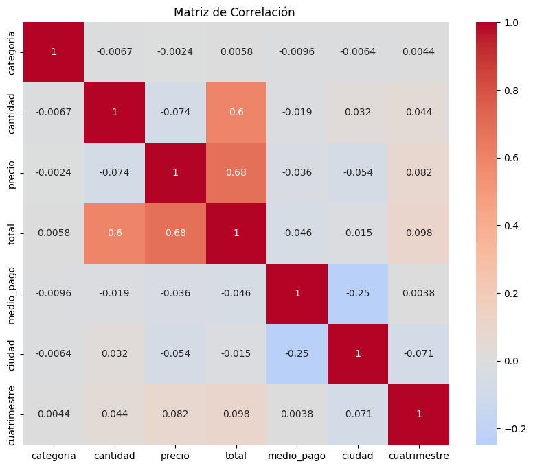

### 8. Análisis de Correlaciones

#### Objetivo
Identificar relaciones lineales entre variables numéricas para entender cómo una variable cambia respecto a otra.

#### Método: Coeficiente de Correlación de Pearson

Mide la relación lineal entre dos variables:
- **Rango**: -1 a 1
- **Cercano a 1**: Correlación positiva fuerte (ambas aumentan juntas)
- **Cercano a -1**: Correlación negativa fuerte (una aumenta, otra disminuye)
- **Cercano a 0**: Sin correlación lineal

#### Visualización: Matriz de Correlación

```python
numericas = df.select_dtypes(include=[np.number])
corr = numericas.corr()

sns.heatmap(corr, annot=True, cmap='coolwarm', center=0)
plt.title('Matriz de Correlación')
plt.show()
```




#### Interpretación del Mapa de Calor
- **Colores cálidos (rojo)**: Correlación positiva
- **Colores fríos (azul)**: Correlación negativa
- **Valores en celdas**: Coeficiente de correlación exacto

#### Correlaciones Significativas Identificadas

Se filtraron pares con correlación absoluta > 0.5:
- **Precio ↔ Total**: Correlación alta (se espera que a mayor precio, mayor total)
- **Cantidad ↔ Total**: Correlación moderada

#### Justificación
Las correlaciones ayudan a:
- Validar relaciones lógicas entre variables
- Identificar variables redundantes
