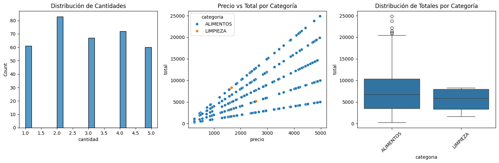
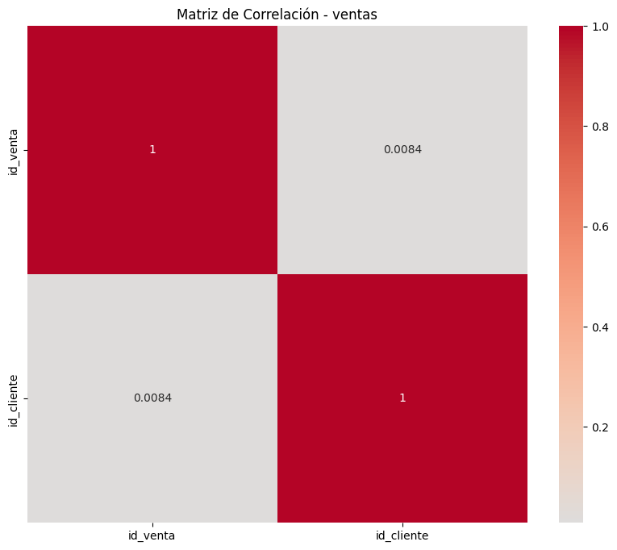

# Visualizaciones y Gráficos

## Descripción
Esta sección presenta diversas visualizaciones que ayudan a entender mejor los patrones y tendencias en los datos de la Tienda Aurelion.

## Tipos de Gráficos

1. **Distribuciones**
   - Histogramas de cantidades vendidas
   - Boxplots de precios unitarios
   - Distribución de importes totales

2. **Relaciones**
   - Scatter plots de precio vs importe
   - Gráficos de barras por categoría
   - Tendencias temporales de ventas

3. **Categorías**
   - Proporción de ventas por categoría
   - Distribución de precios por tipo de producto
   - Volumen de ventas por categoría

## Interpretación
- Los histogramas muestran la frecuencia de valores
- Los boxplots identifican outliers y distribución
- Los scatter plots revelan relaciones entre variables
- Los gráficos de barras comparan categorías

## Graficos
# boxplot





## Código Implementado
```python

fig, (ax1, ax2, ax3) = plt.subplots(1, 3, figsize=(15, 5))

# 1. Distribución de cantidades
sns.histplot(data=df, x='cantidad', bins=20, ax=ax1)
ax1.set_title('Distribución de Cantidades')

# 2. Relación Precio vs Total
sns.scatterplot(data=df, x='precio', y='total', hue='categoria', ax=ax2)
ax2.set_title('Precio vs Total por Categoría')

# 3. Distribución de totales por categoría
sns.boxplot(data=df, x='categoria', y='total', ax=ax3)
ax3.set_title('Distribución de Totales por Categoría')
ax3.tick_params(axis='x', rotation=45)

# Ajustar el layout
plt.tight_layout()
plt.show()
```