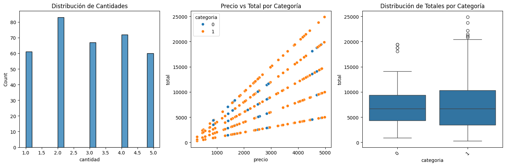

### 9. Análisis de Distribuciones

#### Objetivo
Entender la forma y características de la distribución de variables clave.

#### Visualizaciones Realizadas




**1. Histograma de Cantidades**
- Muestra frecuencia de cantidades vendidas
- Identifica si la mayoría de transacciones son de pocos productos o muchos

**2. Scatter Plot: Precio vs Total (coloreado por Categoría)**
- Verifica la relación visual entre precio y total
- Permite identificar si categorías tienen patrones diferentes
- Ayuda a detectar grupos o clustering

**3. Boxplot de Totales por Categoría**
- Compara distribuciones entre Alimentos y Limpieza
- Identifica si una categoría tiene transacciones más altas/bajas

#### Hallazgos Principales
- **Cantidad**: Distribución sesgada (mayoría de transacciones pequeñas)
- **Precio vs Total**: Relación lineal clara y positiva
- **Por Categoría**: Posibles diferencias en montos por tipo de producto


## Código Implementado
```python

fig, (ax1, ax2, ax3) = plt.subplots(1, 3, figsize=(15, 5))

# 1. Distribución de cantidades
sns.histplot(data=df, x='cantidad', bins=20, ax=ax1)
ax1.set_title('Distribución de Cantidades')

# 2. Relación Precio vs Total
sns.scatterplot(data=df, x='precio', y='total', hue='categoria', ax=ax2)
ax2.set_title('Precio vs Total por Categoría')

# 3. Distribución de totales por categoría
sns.boxplot(data=df, x='categoria', y='total', ax=ax3)
ax3.set_title('Distribución de Totales por Categoría')
ax3.tick_params(axis='x', rotation=45)

# Ajustar el layout
plt.tight_layout()
plt.show()
```