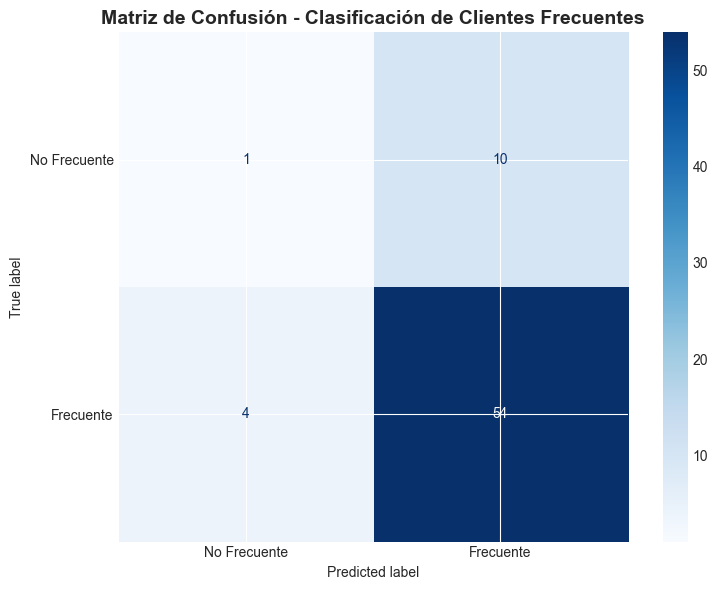

### Resultados Obtenidos

#### **Métricas Calculadas**

```
Accuracy: 0.7971 (79.71%)

              precision    recall  f1-score   support

No Frecuente       0.20      0.09      0.12        11
   Frecuente       0.84      0.93      0.89        58

    accuracy                           0.80        69
   macro avg       0.52      0.51      0.51        69
weighted avg       0.74      0.80      0.76        69
```

#### **Interpretación de Resultados**

- **Accuracy General**: El modelo clasifica correctamente el 79.71% de los casos
- **Clientes Frecuentes**: Recall del 93%, significa que detecta 9 de cada 10 clientes frecuentes
- **Clientes No Frecuentes**: Recall del 9%, tiene dificultad detectando clientes no frecuentes (sesgo hacia clase mayoritaria)

#### **Análisis de Matriz de Confusión**

```
     No Frecuente  Frecuente
No Frecuente     1        10
Frecuente        4        54
```

- **Verdaderos Negativos (TN)**: 1 cliente no frecuente correctamente identificado
- **Falsos Positivos (FP)**: 10 clientes no frecuentes erróneamente clasificados como frecuentes
- **Falsos Negativos (FN)**: 4 clientes frecuentes no detectados
- **Verdaderos Positivos (TP)**: 54 clientes frecuentes correctamente identificados

#### **Métricas Derivadas**

- **Sensibilidad (Recall)**: 93% - Probabilidad de detectar un cliente frecuente (muy alto)
- **Especificidad**: 9% - Probabilidad de identificar un cliente no frecuente (muy bajo)
- **Precisión (Frecuente)**: 84% - Si el modelo predice frecuente, hay 84% probabilidad de ser correcto
- **Precisión (No Frecuente)**: 20% - Si el modelo predice no frecuente, hay solo 20% probabilidad de ser correcto


