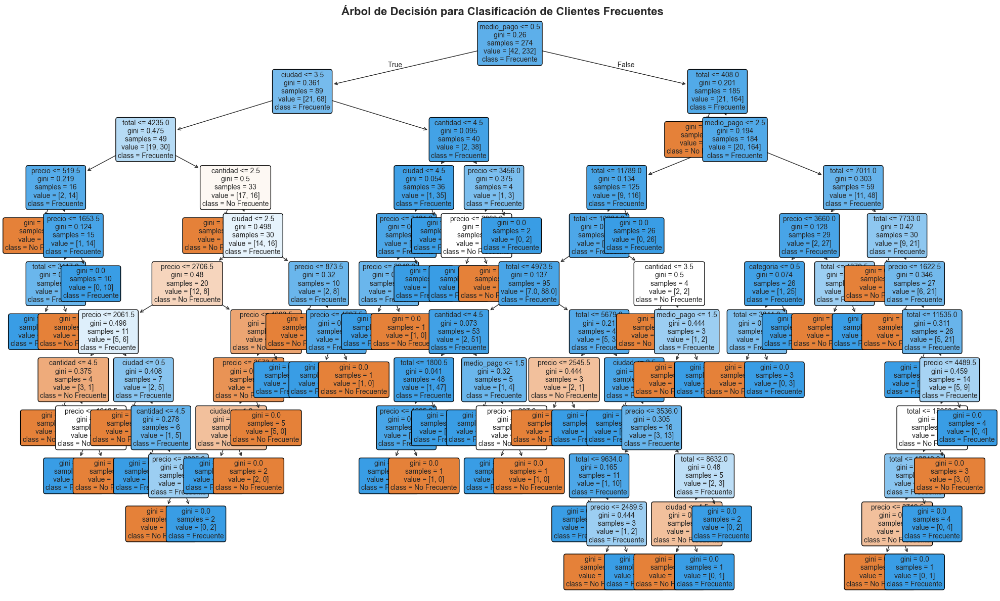

### Modelo ML Implementado

#### **Algoritmo Utilizado: DecisionTreeClassifier**

Se implementó un modelo de clasificación basado en **Árbol de Decisión (DecisionTreeClassifier)** de scikit-learn con los siguientes parámetros:

```python
DecisionTreeClassifier(random_state=42)
```

**Configuración del Modelo:**
- **max_depth**: None (sin limitación de profundidad)
- **random_state**: 42 (reproducibilidad)
- **Features utilizados**: `medio_pago`, `precio`, `categoria`, `ciudad`, `cantidad`
- **Target**: `es_cliente_frecuente` (binario: 0 = No Frecuente, 1 = Frecuente)
- **Train/Test Split**: 80/20 con random_state=42

**Rendimiento:**
- **Accuracy**: 79.71%
- **Recall (Frecuentes)**: 93%
- **Recall (No Frecuentes)**: 09%

#### **Visualización del Árbol de Decisión**



El árbol visualiza las reglas aprendidas por el modelo sobre las 5 variables, mostrando los nodos de decisión y las clasificaciones finales en las hojas.

---