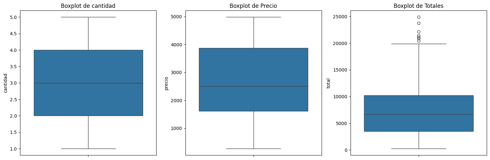

### 7. Detección y Análisis de Outliers

#### Objetivo
Identificar registros con valores atípicos que podrían representar errores de captura, transacciones especiales o anomalías en los datos.

#### Método: Rango Intercuartílico (IQR)

El método IQR es estándar en análisis exploratorio, se utilizo analiticamente el mismo para lograr equivalencia de lo representado graficamente en los graficos boxplot:

1. **Calcular cuartiles**: Q1 (25%) y Q3 (75%)
2. **IQR = Q3 - Q1** (rango donde se concentra el 50% de los datos)
3. **Límites**:
   - Inferior: Q1 - 1.5 × IQR (se utilizara el mayor valor entre cero y este resultado, el limite inferior no puede ser negativo)
   - Superior: Q3 + 1.5 × IQR
4. **Outliers**: Cualquier valor fuera de estos límites

#### Ejemplo Aplicado

```python
def analizar_valores_extremos_iqr(df, columna):
    Q1 = df[columna].quantile(0.25)
    Q3 = df[columna].quantile(0.75)
    IQR = Q3 - Q1
    lower_bound = max(0, Q1 - 1.5*IQR)
    upper_bound = Q3 + 1.5*IQR
    
    outliers = df[(df[columna] < lower_bound) | (df[columna] > upper_bound)]
    return outliers
```

#### Hallazgos

Se analizaron tres variables:
- **Cantidad**: Identifica transacciones con volúmenes inusualmente altos
- **Precio**: Detecta productos con precios fuera del rango típico
- **Total**: Encuentra transacciones con montos extremos (muy altos o muy bajos)

 


#### Interpretación Visual
Los boxplots muestran:
- **Caja central**: 50% de los datos (Q1 a Q3)
- **Línea dentro de la caja**: Mediana
- **Bigotes**: Límites de 1.5×IQR
- **Puntos aislados**: Outliers

#### Decisión: Eliminación de Outliers

- Se detectan 7 registros por fuera de los valores extremos para la columan TOTAL
- Se eliminaron estos registros, para garantizar que el análisis se base en transacciones típicas y evitar sesgos causados por anomalías.

```python
df_limpio = df.copy()

Q1 = np.percentile(df["total"], 25)
Q3 = np.percentile(df["total"], 75)
IQR = Q3 - Q1

limite_inferior = Q1 - 1.5 * IQR
limite_superior = Q3 + 1.5 * IQR

df_limpio = df_limpio[(df_limpio["total"] >= limite_inferior) & (df_limpio["total"] <= limite_superior)]

print(df.info())
print(df_limpio.info())
```
